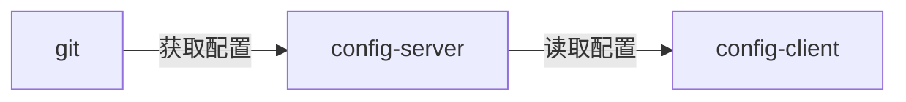

[在上一篇文章](https://chanxinguidao.github.io/springcloud/2019/05/26/SpringCloud%E6%95%99%E7%A8%8B%E7%AC%AC5%E7%AF%87-Zuul.html)讲述zuul的时候，已经提到过，使用配置服务来保存各个服务的配置文件。它就是Spring Cloud Config。

## 一、简介

在分布式系统中，由于服务数量巨多，为了方便服务配置文件统一管理，实时更新，所以需要分布式配置中心组件。在Spring Cloud中，有分布式配置中心组件spring cloud config ，它支持配置服务放在配置服务的内存中（即本地），也支持放在远程Git仓库中。在spring cloud config 组件中，分两个角色，一是config server，二是config client。

## 二、构建Config Server

创建一个spring-boot项目，取名为config-server,其pom.xml:

```
<?xml version="1.0" encoding="UTF-8"?>
<project xmlns="http://maven.apache.org/POM/4.0.0" xmlns:xsi="http://www.w3.org/2001/XMLSchema-instance"
         xsi:schemaLocation="http://maven.apache.org/POM/4.0.0 http://maven.apache.org/xsd/maven-4.0.0.xsd">
    <modelVersion>4.0.0</modelVersion>
    <parent>
        <groupId>org.springframework.boot</groupId>
        <artifactId>spring-boot-starter-parent</artifactId>
        <version>2.1.5.RELEASE</version>
        <relativePath/> <!-- lookup parent from repository -->
    </parent>
    <groupId>com.example</groupId>
    <artifactId>config-server</artifactId>
    <version>0.0.1-SNAPSHOT</version>
    <name>config-server</name>
    <description>Demo project for Spring Boot</description>

    <properties>
        <java.version>1.8</java.version>
        <spring-cloud.version>Greenwich.SR1</spring-cloud.version>
    </properties>

    <dependencies>
        <dependency>
            <groupId>org.springframework.cloud</groupId>
            <artifactId>spring-cloud-config-server</artifactId>
        </dependency>
        <dependency>
            <groupId>org.springframework.cloud</groupId>
            <artifactId>spring-cloud-starter-netflix-eureka-client</artifactId>
        </dependency>

        <dependency>
            <groupId>org.springframework.boot</groupId>
            <artifactId>spring-boot-starter-test</artifactId>
            <scope>test</scope>
        </dependency>
    </dependencies>

    <dependencyManagement>
        <dependencies>
            <dependency>
                <groupId>org.springframework.cloud</groupId>
                <artifactId>spring-cloud-dependencies</artifactId>
                <version>${spring-cloud.version}</version>
                <type>pom</type>
                <scope>import</scope>
            </dependency>
        </dependencies>
    </dependencyManagement>

    <build>
        <plugins>
            <plugin>
                <groupId>org.springframework.boot</groupId>
                <artifactId>spring-boot-maven-plugin</artifactId>
            </plugin>
        </plugins>
    </build>

</project>

```

在程序的入口Application类加上@EnableConfigServer注解开启配置服务器的功能，代码如下：

```
package com.example.configserver;

import org.springframework.boot.SpringApplication;
import org.springframework.boot.autoconfigure.SpringBootApplication;
import org.springframework.cloud.config.server.EnableConfigServer;

@EnableConfigServer
@SpringBootApplication
public class ConfigServerApplication {

    public static void main(String[] args) {
        SpringApplication.run(ConfigServerApplication.class, args);
    }

}

```

需要在程序的配置文件application.properties文件配置以下：

如果是私有的库要修改 username 跟 password，如果是公开的就随便写

```
spring:
  application:
    name: config-server
  cloud:
    config:
      server:
        git:
          uri: https://github.com/chanxinguidao/SpringCloudConfig/
          search-paths: config
          username: hello
          password: hello
      label: master

server:
  port: 8888
```

- spring.cloud.config.server.git.uri：配置git仓库地址
- spring.cloud.config.server.git.searchPaths：配置仓库路径
- spring.cloud.config.label：配置仓库的分支
- spring.cloud.config.server.git.username：访问git仓库的用户名
- spring.cloud.config.server.git.password：访问git仓库的用户密码

如果Git仓库为公开仓库，可以不填写用户名和密码，如果是私有仓库需要填写，本例子是公开仓库，放心使用。

远程仓库https://github.com/chanxinguidao/SpringCloudConfig/ 中有个文件config-client-dev.properties文件中有一个属性：

> version=V0.1

启动程序：访问http://localhost:8888/test/dev  (这个只是测试用随便写)

```
{"name":"test","profiles":["dev"],"label":"master",
"version":"34523ab3b53f4b138d28e89b576900ac5e014667","state":null,"propertySources":[]}
```

证明配置服务中心可以从远程程序获取配置信息。

http请求地址和资源文件映射如下:

- /{application}/{profile}[/{label}]
- /{application}-{profile}.yml
- /{label}/{application}-{profile}.yml
- /{application}-{profile}.properties
- /{label}/{application}-{profile}.properties

## 三、构建一个config client

重新创建一个springboot项目，取名为config-client,其pom文件：

```
<?xml version="1.0" encoding="UTF-8"?>
<project xmlns="http://maven.apache.org/POM/4.0.0" xmlns:xsi="http://www.w3.org/2001/XMLSchema-instance"
         xsi:schemaLocation="http://maven.apache.org/POM/4.0.0 http://maven.apache.org/xsd/maven-4.0.0.xsd">
    <modelVersion>4.0.0</modelVersion>
    <parent>
        <groupId>org.springframework.boot</groupId>
        <artifactId>spring-boot-starter-parent</artifactId>
        <version>2.1.5.RELEASE</version>
        <relativePath/> <!-- lookup parent from repository -->
    </parent>
    <groupId>com.example</groupId>
    <artifactId>config-client</artifactId>
    <version>0.0.1-SNAPSHOT</version>
    <name>config-client</name>
    <description>Demo project for Spring Boot</description>

    <properties>
        <java.version>1.8</java.version>
        <spring-cloud.version>Greenwich.SR1</spring-cloud.version>
    </properties>

    <dependencies>
        <dependency>
            <groupId>org.springframework.boot</groupId>
            <artifactId>spring-boot-starter-web</artifactId>
        </dependency>
        <dependency>
            <groupId>org.springframework.cloud</groupId>
            <artifactId>spring-cloud-starter-config</artifactId>
        </dependency>

        <dependency>
            <groupId>org.springframework.boot</groupId>
            <artifactId>spring-boot-starter-test</artifactId>
            <scope>test</scope>
        </dependency>
    </dependencies>

    <dependencyManagement>
        <dependencies>
            <dependency>
                <groupId>org.springframework.cloud</groupId>
                <artifactId>spring-cloud-dependencies</artifactId>
                <version>${spring-cloud.version}</version>
                <type>pom</type>
                <scope>import</scope>
            </dependency>
        </dependencies>
    </dependencyManagement>

    <build>
        <plugins>
            <plugin>
                <groupId>org.springframework.boot</groupId>
                <artifactId>spring-boot-maven-plugin</artifactId>
            </plugin>
        </plugins>
    </build>

</project>

```

其配置文件：

配置中心的服务端默认是8888端口，如果没有改优先级不要改这个端口哦，老鸟绕路：

```
spring:
  cloud:
    config:
      label: master
      profile: dev
      uri: http://localhost:8888/
  application:
    name: config-client

```

- spring.cloud.config.label 指明远程仓库的分支
- spring.cloud.config.profile
  - dev开发环境配置文件
  - test测试环境
  - pro正式环境
- spring.cloud.config.uri= http://localhost:8888/ 指明配置服务中心的网址。

程序的入口类，写一个API接口“／hi”，返回从配置中心读取的foo变量的值，代码如下：

```
package com.example.configclient;

import org.springframework.beans.factory.annotation.Value;
import org.springframework.boot.SpringApplication;
import org.springframework.boot.autoconfigure.SpringBootApplication;
import org.springframework.cloud.client.discovery.EnableDiscoveryClient;
import org.springframework.web.bind.annotation.GetMapping;
import org.springframework.web.bind.annotation.RequestMapping;
import org.springframework.web.bind.annotation.RestController;

/**
 * 偷懒直接当controller了
 */
@RestController
@SpringBootApplication
public class ConfigClientApplication {

    public static void main(String[] args) {
        SpringApplication.run(ConfigClientApplication.class, args);
    }


    @Value("${version}")
    String version;

    @GetMapping(value = "/hi")
    public String hi(){
        return version;
    }
}

```

打开网址访问：http://localhost:8080/hi，网页显示：

> V0.1

这就说明，config-client从config-server获取了version的属性，而config-server是从git仓库读取的,如图：




本文源码下载：<https://github.com/chanxinguidao/SpringCloudLearning/tree/master/chapter6>
